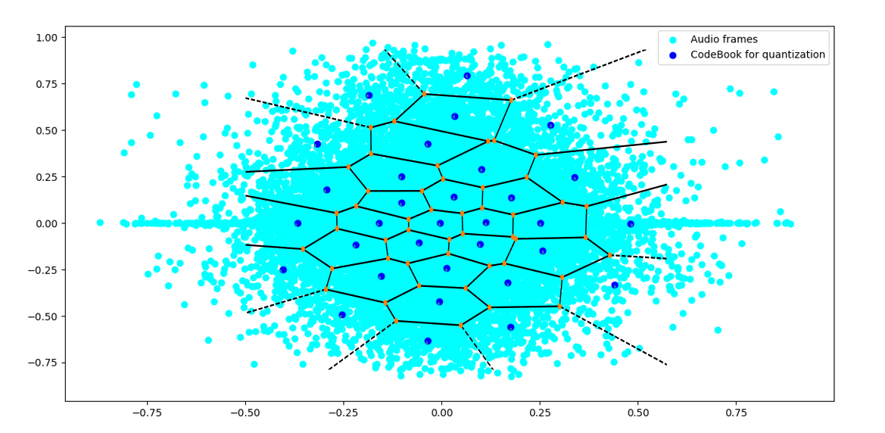

# audioCodec
An implementation of vector quantization 'K-Means' for audio wav file quantization

# model


# requirements
* [**numpy**](https://www.numpy.org)

# usage
```python
from vectorQuantization import vectorQuant

trainFile = 'train.wav' # audio file for training the codeBook
wavFile = 't16.wav'  # audio file to be quantized
outBin = 'out.bin' # binary file name to store quantized signal in
outWav = 'reconstructed.wav' # wav file name for reconstricted signal
dim = [16,2] # dimensions of the codebook
eps = 1e-2 # threshold to exist the iteration process for codebook generartion

myObj = vectorQuant(trainFile,eps,dim) # create object with input paramters

codeBook = myObj.createModel(livePlot=False) # create a codebook moedel based on the object properties, if the second dimension of the codebook is 2, a live plot can be enabled to see the progress, the default is False.

outputDecoded = myObj.applyVectorQ(self,wavFile) # apply the created model to quantize audio file, and return the dequantized value.
saveBin(self,binFile) # save the indices of the audio, the codebook, and the sampling rate into a binary file
saveWav(self,binFile) # save the dequantizd values into wav file for playback


```


# todo
* add method to read binary file and output a wav file
* find faster way for codebook iterations
* support different types of signals


## License

This work is licensed under a Creative Commons Attribution-NonCommercial 4.0 International License, which allows for personal and research use only. For a commercial license please contact the authors. You can view a license summary here: http://creativecommons.org/licenses/by-nc/4.0/
